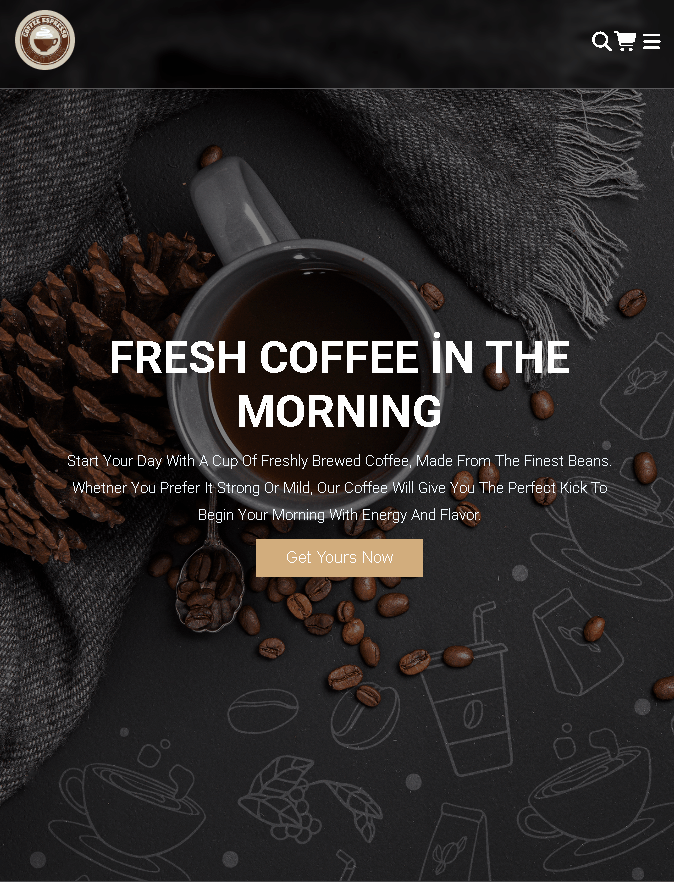

<h1>☕ Coffee Project </h1>

    A modern and responsive coffee shop website designed to showcase menu items, brand identity, and customer experience.

This project focuses on clean UI, smooth user interaction, and full responsiveness across devices.

<h2>🌐 Website View</h2>

  

<h2>📱 Responsive View</h2>

  

<h2>🚀 Features</h2>

<ul>
<li>- Modern and clean coffee shop design</li>
<li>- Fully responsive layout (mobile, tablet, desktop)</li>
<li>- Smooth scrolling experience</li>
<li>- Well-structured sections (Hero, Menu, About, Contact)</li>
<li>- User-friendly UI/UX</li>
</ul>

<h2>🛠️ Technologies Used</h2>

<ul>
<li>- HTML5</li>
<li>- CSS3 (Flexbox & Media Queries)</li>
<li>- JavaScript</li>
</ul>

